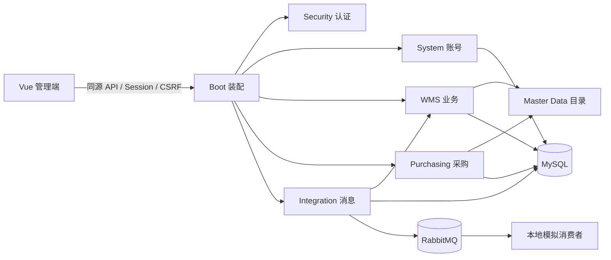

# 架构与代码阅读

采购数量履约新增 `PurchaseFulfillment`：通过 common 的 `PurchaseReceivingPort` 和 integration 适配器读取 WMS 事实，按稳定来源行归集，采购不直接访问 WMS 表或用库存余额推算。详情可重复读；结案与正式来源 WMS 写入统一“仓库→通知/明细”锁序。`pur_closure` 保存不可变来源快照；当前事实不一致时保留原结案并提示核对。正式链路是同库查询契约，已有模拟 Outbox 不作为结案依据，拆库后的消息协议不在本版范围。见[采购 P3](../erp/采购P3实现与验收.md)。

当前应用是一个 Spring Boot 进程配一个 Vue 管理端的模块化单体。数据库是业务事实来源，RabbitMQ 用于可靠事件，Redis 目前仅有基础设施与测试基线，尚未承载业务缓存、分布式会话或限流。完整文件入口见[源码导航](source-index.md)。

## 实际模块边界

| 模块 | 责任 | 阅读入口 |
|---|---|---|
| `mdop-boot` | 应用装配、配置、通用错误处理、跨模块集成测试 | `MdopApplication`、`ApiProblemHandler`、`src/test` |
| `mdop-common` | 业务异常、操作人和仓库目录等小型公共契约 | `CurrentActorProvider`、`WarehouseDirectory` |
| `mdop-security` | Session/CSRF、认证配置、逐请求账号版本校验 | `MdopSecurityConfiguration`、`AccountSessionFilter` |
| `mdop-system` | 账号持久化、角色、初始化、权限修改和审计 | `AccountService`、`PermissionCatalog` |
| `mdop-master-data` | 仓库聚合及供应商、物料、库位目录 | `WarehouseService`、`CatalogService` |
| `mdop-purchasing` | 采购需求、订单、异人审核、来源和审计 | `PurchaseService`、`PurchaseController`；不写 WMS 库存 |
| `mdop-wms` | 收货、库存、生产协同、出入库与操作规则 | `receiving`、`inventory` 两个实际包 |
| `mdop-integration` | 消息发布、消费、重试、重放与模拟接收 | `DeliveryService`、`DeliveryWorker`、各 Listener |
| `mdop-test-support` | Testcontainers 共享隔离基础设施 | `MdopInfrastructureTestBase`；应用仅测试依赖 |

采购到货使用 `common/PurchaseReceivingPort` 契约，由 `integration/PurchaseReceivingAdapter` 转给 WMS `PurchaseArrivalService`。当前同进程同库：采购安排/映射与 WMS 通知送达、撤回均加入调用方事务；采购不读写 WMS 表。WMS 正式采购收货按“仓库→通知”锁顺序与撤回协调。待送达安排及失败原因归采购自身持久化，显式送达/重试；这条本地链路不经过模拟 ERP 或 RabbitMQ，不宣称已实现远程可靠投递。

图展示运行职责，不代替 Maven 依赖图；逐模块直接依赖由[源码导航](source-index.md)从 POM 生成。仓库聚合使用 JPA；账号、其他主数据与 WMS 大量使用 JdbcClient/参数化 SQL，属于当前取舍，不是所有模块统一 DDD 四层。

## 从一笔收货读起

1. [ReceivingView.vue](../../frontend/apps/admin/src/views/ReceivingView.vue)：选通知、编辑草稿、保持幂等键、刷新结果。API/CSRF 与数量运算分别在 [api.ts](../../frontend/apps/admin/src/api.ts) 和 [quantity.ts](../../frontend/apps/admin/src/quantity.ts)。
2. [ReceivingController.java](../../backend/mdop-wms/src/main/java/io/github/acczff/mdop/wms/receiving/ReceivingController.java)：HTTP 映射、DTO 校验和操作权限；[ReceivingModels.java](../../backend/mdop-wms/src/main/java/io/github/acczff/mdop/wms/receiving/ReceivingModels.java) 定义输入输出。
3. [ReceivingService.java](../../backend/mdop-wms/src/main/java/io/github/acczff/mdop/wms/receiving/ReceivingService.java)：业务状态、仓库范围、幂等和事务。在事务中锁定通知/单据，按固定维度顺序锁余额，写库存流水和 Outbox。
4. [DeliveryWorker.java](../../backend/mdop-integration/src/main/java/io/github/acczff/mdop/integration/messaging/DeliveryWorker.java) 与 [DeliveryService.java](../../backend/mdop-integration/src/main/java/io/github/acczff/mdop/integration/messaging/DeliveryService.java)：后台重试与发布；网络调用不进入库存事务。消息被代理确认和外部系统实际接收是两个状态。
5. [ReceivingTests.java](../../backend/mdop-boot/src/test/java/io/github/acczff/mdop/ReceivingTests.java)、[MessagingTests.java](../../backend/mdop-boot/src/test/java/io/github/acczff/mdop/MessagingTests.java) 与 [Receiving.spec.ts](../../frontend/apps/admin/src/__tests__/Receiving.spec.ts)：从回归理解正常、重复、并发、失败及权限边界。

## 不能破坏的业务约束

- 数量是业务精度：数据库 `DECIMAL(18,6)`、Java `BigDecimal`、JSON 十进制字符串、前端定点整数。不能使用浮点数直接累计库存。
- 库存写入包含余额、流水和业务单据的同一事务；Outbox 与业务原子落库，外部网络通过后续投递处理。
- 已提交事实不可覆盖；冲正写关联的反向记录，保留申请人、审批人、原因及历史。
- 幂等以相同键和相同载荷识别同一动作，不能遇到失败就换键。并非所有接口都有幂等键，详见[接口约定](api.md)。
- WMS 服务同时检查角色与仓库范围。基础资料目录不提供租户隔离；角色互斥和禁止自审是两道不同约束。
- Flyway 是表结构来源。已应用迁移不改写，新增结构只能新增全局唯一版本；不会用 Hibernate 自动改表。

## 前端结构与修改位置

路由在 `src/router/index.ts`；App 负责会话，WorkspaceShell 和 navigation 负责导航；页面组件负责各自查询/操作状态，只有真实复用时才提取组件。目前 Pinia 已装配但没有业务 Store；`packages/*` 只是工作区预留项。

现有页面多数将表单、列表和状态处理放在同一个 Vue SFC 中。较大的收货、库存、领料页面应在下一次修改对应功能时按查询/表单职责拆分，并保持失败、迟到响应、切仓与重复点击保护。此次文档整理不批量移动业务类或改变事务边界。

## 质量保证的实际边界

Maven Enforcer 检查版本、依赖收敛和禁止依赖 boot；Spotless 检查 Java 格式；Testcontainers 验证真实数据库与消息行为。JaCoCo 生成报告但无覆盖率阈值。当前没有完整的包级架构约束测试，不宣称所有跨模块约束都已自动保障。

前端执行格式、ESLint、组件测试、类型检查和构建。浏览器验收目前按清单人工执行，并非 CI 端到端浏览器测试。新增文档检查只防止导航和链接漂移，不证明业务正确。检查命令见[贡献指南](../../CONTRIBUTING.md)。
